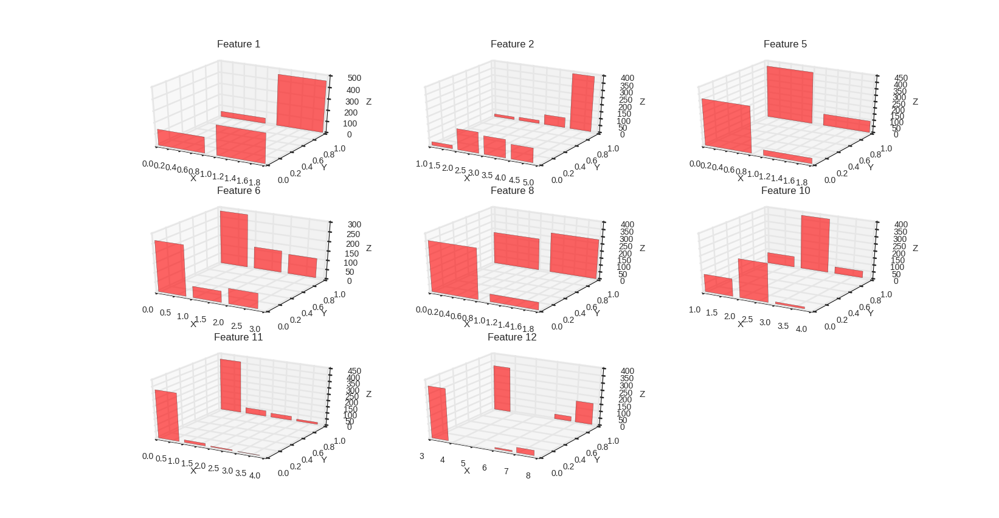

# Heart-Disease-Classification-using-PGM
Heart Disease Classification using Naive Bayes and PGM - Third project of Statistical Machine Learning course

    

        
    

    

        Visualisation of data
    

In this project, we implemented naive bayes model on a data set of heart disease.(UCI Heart Disease Data). Pre processing operations like discretizing continuous values and filling missing values were done. 2 probabilistic graphical model and 3 bayesian network using different subsets of data were designed and evaluated.

